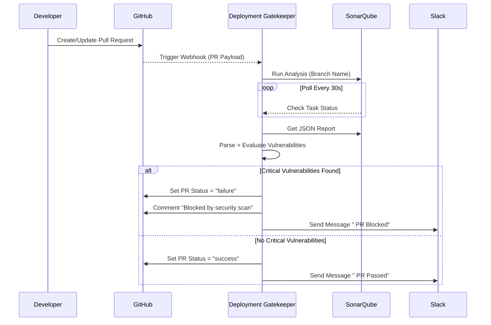
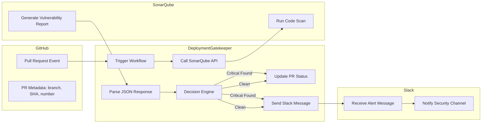

# DevSecOps Deployment Gatekeeper Architecture

## Table of Contents
1. [Overview](#overview)
2. [Workflow Sequence Diagram](#workflow-sequence-diagram)
3. [Data Flow Diagram](#data-flow-diagram)
4. [Decision Logic Flow](#decision-logic-flow)
5. [System Components](#system-components)
6. [Integration Points](#integration-points)

## Overview

The DevSecOps Deployment Gatekeeper follows an event-driven architecture designed to automatically scan, analyze, and make deployment decisions for pull requests based on security vulnerabilities. The system integrates with GitHub, SonarQube, and Slack to provide a seamless security gate in the CI/CD pipeline.

## Workflow Sequence Diagram

The workflow sequence diagram illustrates the event order and API interactions between systems:



## Data Flow Diagram

The data flow diagram (Level 1) shows how data moves through the system components:



## Decision Logic Flow

The decision logic flow represents how vulnerability data is processed to decide PR status:

```mermaid
flowchart TD
    A[Start: SonarQube JSON Received] --> B[Extract "critical_vulnerabilities"]
    B --> C{critical_vulnerabilities > 0?}
    C -->|Yes| D[Set PR Status: "failure"]
    D --> E[Comment: "Blocked by security scan"]
    E --> F[Send Slack Alert]
    C -->|No| G[Set PR Status: "success"]
    G --> H[Send Slack Message]
    F --> I[End]
    H --> I
```

## System Components

### 1. GitHub Integration Module
- **Function**: Monitors GitHub for new pull requests
- **Responsibilities**:
  - Receives webhook events from GitHub
  - Extracts PR metadata (branch name, SHA, PR number)
  - Updates PR status based on security analysis results

### 2. Analysis Engine
- **Function**: Coordinates SonarQube security scans
- **Responsibilities**:
  - Triggers SonarQube analysis on PR branches
  - Polls SonarQube for scan completion
  - Retrieves and parses vulnerability reports

### 3. Decision Engine
- **Function**: Evaluates scan results against security policies
- **Responsibilities**:
  - Processes vulnerability data
  - Applies security policies (zero critical vulnerabilities allowed)
  - Makes deployment approval/rejection decisions

### 4. Notification System
- **Function**: Communicates results through Slack
- **Responsibilities**:
  - Sends alerts to security channels
  - Provides detailed vulnerability information
  - Notifies developers of deployment decisions

## Integration Points

### GitHub Integration
- **Webhook Events**: Pull request creation/update triggers
- **Status API**: Updates PR status (success/failure)
- **Comments API**: Adds security scan feedback to PRs

### SonarQube Integration
- **Analysis API**: Triggers code scans on PR branches
- **Issues API**: Retrieves vulnerability reports
- **Task API**: Polls for scan completion status

### Slack Integration
- **Web API**: Sends messages to designated channels
- **Bot Integration**: Uses bot user for notifications
- **Message Formatting**: Provides structured security alerts

## Security Policies

The system enforces a zero-tolerance policy for critical vulnerabilities:
- Any PR with critical vulnerabilities is automatically blocked
- Clean PRs (no critical vulnerabilities) are approved for deployment
- All decisions are logged for audit purposes
- Notifications are sent to relevant stakeholders immediately

## Data Flow Process

1. **Trigger Phase**: Developer creates/updates PR → GitHub sends webhook → Deployment Gatekeeper receives payload
2. **Analysis Phase**: System extracts PR metadata → Triggers SonarQube scan → Polls for completion → Retrieves report
3. **Decision Phase**: System parses vulnerabilities → Evaluates against policies → Makes deployment decision
4. **Notification Phase**: Updates PR status → Sends Slack notifications → Logs decision for audit

This architecture ensures that every pull request is automatically scanned for security vulnerabilities before deployment, with clear feedback provided to developers and stakeholders.