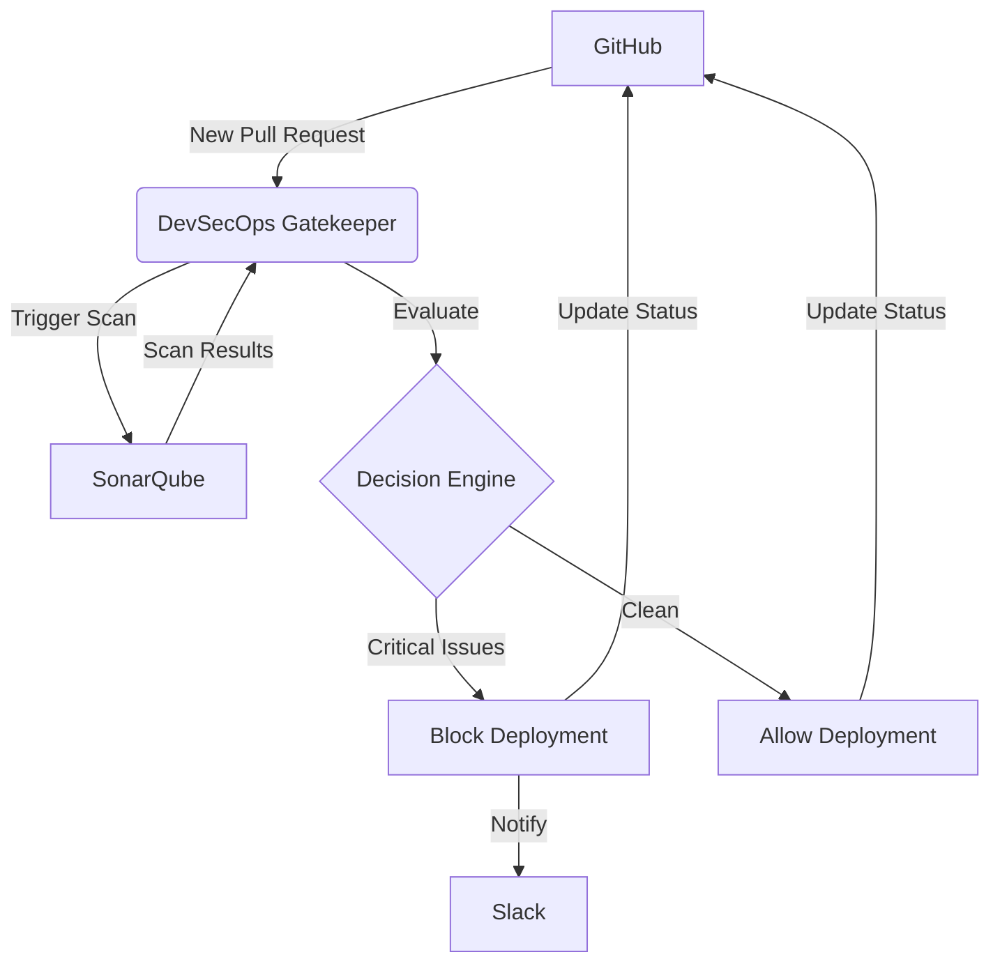

# DevSecOps Deployment Gatekeeper: Comprehensive Implementation Guide

## Table of Contents
1. [Project Overview](#project-overview)
2. [System Architecture](#system-architecture)
3. [Installation and Setup](#installation-and-setup)
4. [Configuration](#configuration)
5. [Usage Guide](#usage-guide)
6. [API Integration Details](#api-integration-details)
7. [Security Considerations](#security-considerations)
8. [Testing](#testing)
9. [Troubleshooting](#troubleshooting)
10. [Extending the System](#extending-the-system)

## Project Overview

The DevSecOps Deployment Gatekeeper is an intelligent automation system that integrates with existing development tools to scan, analyze, and block potentially harmful code changes before they reach production environments. The system follows a zero-tolerance policy for critical vulnerabilities in production deployments.

### Key Features
- Automated security scanning of pull requests
- Integration with GitHub, SonarQube, and Slack
- AI-powered decision making for deployment approval
- Real-time notifications and feedback
- Comprehensive audit trail of security checks
- Configurable security policies

### Goals
1. Implement a zero-tolerance policy for critical vulnerabilities in production deployments
2. Reduce the time between vulnerability detection and remediation
3. Enhance security awareness among development teams through immediate feedback
4. Create an auditable trail of security checks and decisions
5. Minimize false positives that could hinder development productivity

## System Architecture

### High-Level Components
1. **Trigger Module**: Monitors GitHub for new pull requests
2. **Analysis Engine**: Coordinates SonarQube security scans
3. **Decision Engine**: Evaluates scan results against security policies
4. **Notification System**: Communicates results through GitHub and Slack

### Data Flow
1. Developer creates/updates pull request in GitHub
2. GitHub webhook triggers the DevSecOps Deployment Gatekeeper workflow
3. System extracts PR details and initiates SonarQube scan
4. SonarQube analyzes code for security vulnerabilities
5. System polls SonarQube for completion and retrieves results
6. Decision engine processes results and determines deployment eligibility
7. System updates PR status in GitHub based on security findings
8. System sends notification to relevant Slack channels
9. Developer receives feedback and takes remedial action if needed

### Component Interactions


## Installation and Setup

### Prerequisites
- Python 3.10 or higher
- Access to GitHub repositories
- SonarQube instance (Developer Edition or higher)
- Slack workspace with bot permissions

### Installation Steps

1. **Clone the Repository**
   ```bash
   git clone <repository-url>
   cd devops-deployment-security-gate
   ```

2. **Install Dependencies**
   ```bash
   # Using pip
   pip install -r requirements.txt
   
   # Or using uv (recommended)
   pip install uv
   uv pip install -r requirements.txt
   ```

3. **Set Up Environment Variables**
   ```bash
   cp .env.example .env
   # Edit .env with your actual credentials
   ```

## Configuration

### Environment Variables
Create a `.env` file in the project root with the following variables:

```env
# OpenAI Configuration
OPENAI_API_KEY=your_openai_api_key

# GitHub Configuration
GITHUB_TOKEN=your_github_token
GITHUB_WEBHOOK_SECRET=your_webhook_secret

# SonarQube Configuration
SONARQUBE_URL=https://your-sonarqube-instance.com
SONARQUBE_TOKEN=your_sonarqube_token

# Slack Configuration
SLACK_BOT_TOKEN=your_slack_bot_token

# Optional Settings
SECRET_KEY=your_secret_key
LOG_LEVEL=INFO
```

### Agent Configuration
Modify `src/devops_deployment_security_gate/config/agents.yaml` to customize agent roles and behaviors.

### Task Configuration
Modify `src/devops_deployment_security_gate/config/tasks.yaml` to customize task descriptions and expected outputs.

## Usage Guide

### Running Security Checks
```bash
python -m devops_deployment_security_gate run \
  --pr-number 123 \
  --repository myorg/myrepo \
  --branch feature-branch \
  --project-key myorg_myrepo_feature-branch \
  --slack-channel "#security-alerts"
```

### Training the System
```bash
python -m devops_deployment_security_gate train \
  --iterations 10 \
  --data-path ./training_data/ \
  --output ./trained_model.json
```

### Replaying Task Executions
```bash
python -m devops_deployment_security_gate replay \
  --task-id task_12345 \
  --output ./replay_results.json
```

### Testing the System
```bash
python -m devops_deployment_security_gate test \
  --iterations 5 \
  --model gpt-4 \
  --data-path ./test_data/ \
  --output ./test_results.json
```

### Validating Configuration
```bash
python -m devops_deployment_security_gate config validate
```

## API Integration Details

### GitHub Integration
The system integrates with GitHub through:
- GitHub REST API v3
- Webhook events for pull request triggers
- Status API for deployment approvals
- Pull Request API for metadata extraction

**Required Permissions:**
- `repo` scope for repository access
- `repo:status` for status updates
- Webhook configuration access

### SonarQube Integration
The system integrates with SonarQube through:
- SonarQube REST API
- Analysis triggering and polling
- Issue search and retrieval
- Quality gate evaluation

**Required Permissions:**
- Execute Analysis permission
- Quality Gates API access
- Issues API access

### Slack Integration
The system integrates with Slack through:
- Slack Web API
- Chat.postMessage for notifications
- Bot user permissions

**Required Permissions:**
- `chat:write` scope
- Channel membership for target channels

## Security Considerations

### Data Privacy
- All API communications use HTTPS encryption
- Sensitive data is not logged or stored unnecessarily
- Environment variables are used for credential storage
- Data retention policies should be implemented for scan results

### Access Control
- Principle of least privilege for all service accounts
- OAuth tokens with restricted scopes
- Role-based access control for system components
- Audit trail logging for all access and actions

### Vulnerability Management
- Regular updates of all system components
- Webhook signature validation before processing
- Input sanitization to prevent injection attacks
- Proper error handling to prevent information leakage

## Testing

### Unit Testing
Run unit tests with:
```bash
python -m pytest tests/
```

Or use the test runner:
```bash
python tests/run_tests.py
```

### Test Coverage
The test suite includes:
- Security model validation
- Tool functionality testing
- Agent behavior testing
- Main command handling
- Integration scenario testing

### Continuous Integration
For CI/CD integration, add the following to your pipeline:
```yaml
- name: Security Gate Check
  run: |
    python -m devops_deployment_security_gate run \
      --pr-number ${{ github.event.pull_request.number }} \
      --repository ${{ github.repository }} \
      --branch ${{ github.head_ref }}
```

## Troubleshooting

### Common Issues and Solutions

1. **Authentication Errors**
   - Verify all environment variables are set correctly
   - Check token permissions and expiration dates
   - Ensure URLs are correctly formatted

2. **API Rate Limiting**
   - Implement exponential backoff for API calls
   - Monitor rate limit headers in responses
   - Consider caching strategies for repeated requests

3. **Network Connectivity**
   - Verify firewall rules allow outbound connections
   - Check DNS resolution for service endpoints
   - Test connectivity with curl or similar tools

4. **Performance Issues**
   - Monitor system resources during execution
   - Optimize SonarQube scan configurations
   - Implement timeout and retry logic appropriately

### Logging and Debugging
Enable debug logging by setting:
```env
LOG_LEVEL=DEBUG
```

Check logs for:
- API request/response details
- Error stack traces
- Performance metrics
- Security-related events

## Extending the System

### Adding New Agents
1. Create a new agent class in `src/devops_deployment_security_gate/agents/`
2. Define the agent's role, goal, and backstory
3. Implement custom methods for specialized functionality
4. Register the agent in the crew configuration

### Adding New Tools
1. Create a new tool class in `src/devops_deployment_security_gate/tools/`
2. Extend the `BaseTool` class from crewAI
3. Implement the `_run` method with your custom logic
4. Add the tool to the appropriate agent

### Customizing Security Policies
1. Modify the `SecurityPolicyDecisionEngine` class
2. Adjust threshold values in `settings.py`
3. Implement custom policy evaluation logic
4. Add new policy violation types as needed

### Integration with Other Services
1. Create new tool classes for each service
2. Implement authentication and API interaction logic
3. Add the tools to the appropriate agents
4. Update task definitions to use the new capabilities

## Conclusion

The DevSecOps Deployment Gatekeeper provides a robust framework for integrating security checks into your CI/CD pipeline. By automating vulnerability detection and enforcement, the system helps maintain a strong security posture while preserving development velocity.

Regular maintenance, updates, and monitoring are essential for ensuring the system continues to provide effective security protection. The modular architecture allows for easy customization and extension to meet specific organizational requirements.